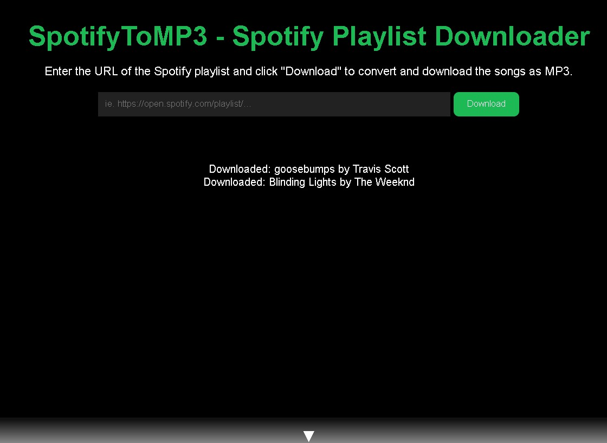

# SpotifyToMp3



## Description
Spotify Playlist Downloader is a web application built with Flask that allows you to easily download songs from a Spotify playlist and convert them to MP3 format. It uses the `yt-dlp` library for downloading audio files from YouTube.

## Installation
1. Clone the repository:
```git clone https://github.com/your-username/spotify-playlist-downloader.git```
2. Navigate to the project directory:
```cd spotify-playlist-downloader```
3. Create a virtual environment (recommended):
```python -m venv venv```
4. Activate the virtual environment:
```venv\Scripts\activate```
5. Install the required packages:
```pip install -r requirements.txt```
6. Start the Flask application:
``python app.py```

## Usage
1. Open your web browser and go to `http://127.0.0.1:5000`
2. Enter the URL of the Spotify playlist you want to download
3. Click the "Download" button
4. The download progress will be displayed in real-time
5. Check your Downloads folder for the downloaded MP3 files

## Technologies Used
- Flask
- yt-dlp
- HTML/CSS/JavaScript

## Getting URL of Spotify Playlist
- Open your Spotify app and to the playlist you'd like to download
- Click on the "3 dots" button
- Click "Share" and then "Copy Link"

## Next Steps
- Host this live 
